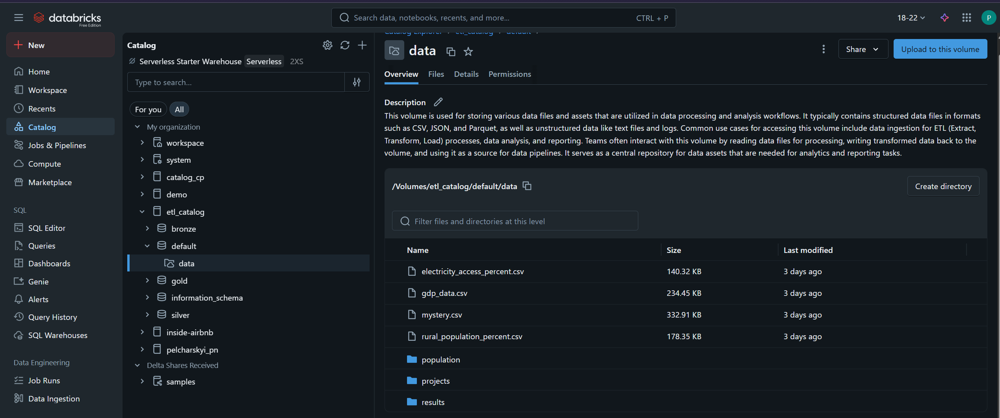
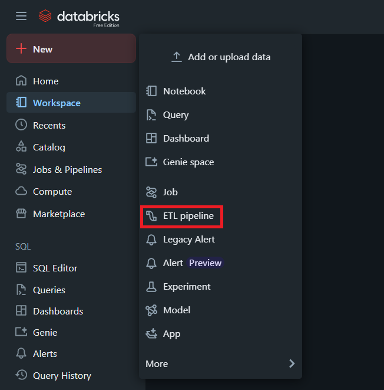
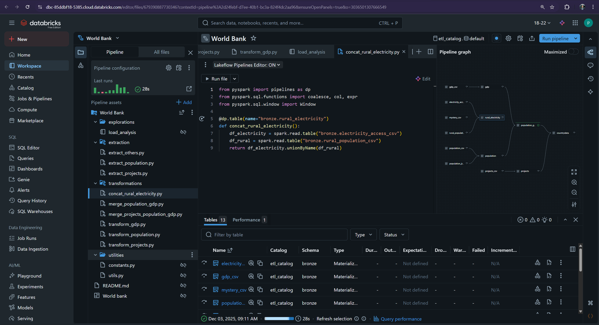
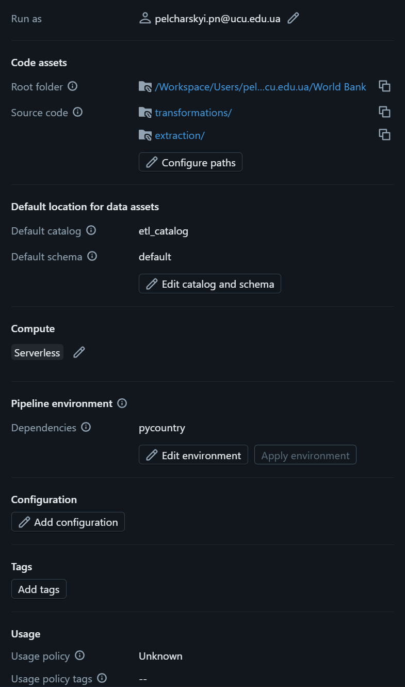
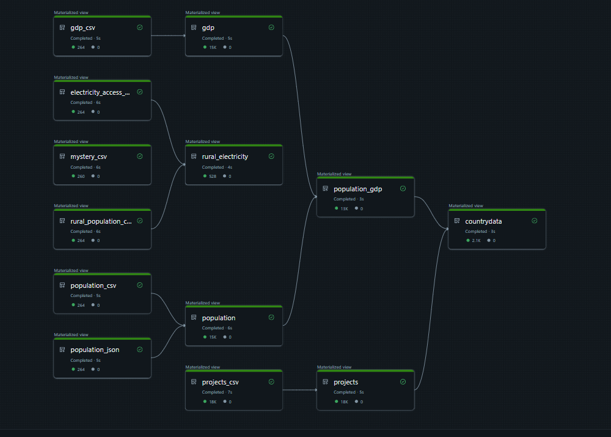
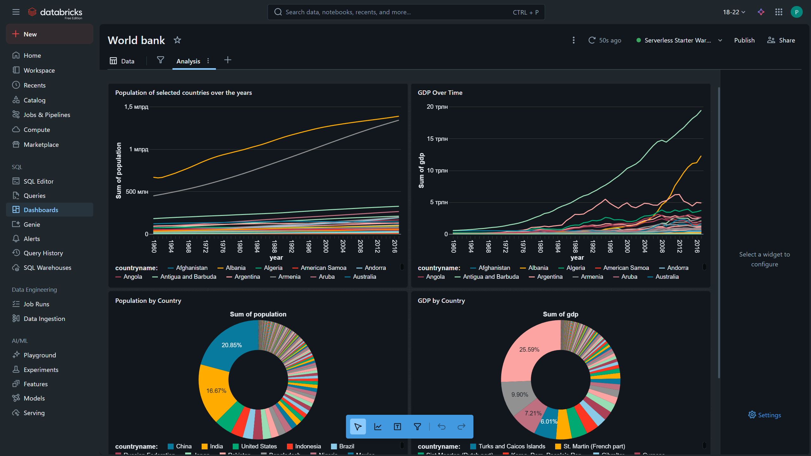

# ETL Pipeline Reproduction Guide

This document describes the steps required to reproduce an end-to-end ETL pipeline on Databricks using the provided code and data.

# 1. Environment and Data Preparation

## 1.1. Downloading Code and Data, Uploading to Databricks

Download the project code and datasets from the following repository directories:

- `end-to-end-etl-pipeline/demo/src`
- `end-to-end-etl-pipeline/demo/data`

Create a new catalog in Databricks and upload the data so that the directory structure matches the following:

```
<your_catalog>/
├── default/
│   ├── data/
│   │   |── electricity_access_percent.csv
│   │   |── gdp_data.csv
│   │   |── mystery.csv
│   │   |── rural_population_percent.csv
│   │   ├── population/
│   │   │   ├── population_data.py
│   │   │   └── population_data.json
│   │   ├── projects/
│   │   │   └── projects_data.json
```



*The `results` folder will appear later during pipeline execution.*

## 1.2. Creating Delta Lake Schemas

The ETL workflow relies on Delta Lake tables. Create the following schemas within the same catalog and directory as the uploaded data:

- **bronze**
- **silver**
- **gold**

These schemas will store tables at different processing stages throughout the pipeline.


# 2. Creating the ETL Pipeline in Databricks

An ETL pipeline can be created directly from the Databricks workspace. Select **New → ETL Pipeline** from the left-hand menu.



Follow the prompts, ensuring that the correct catalog and directory created in Step 1 are selected.


# 3. Pipeline Configuration

## 3.1. Uploading Pipeline Code

Upload the previously downloaded script files to the pipeline so that the structure matches the layout shown in the repository. Validate that all files appear in the correct directories:



## 3.2. Configuring Pipeline Settings

Open **Pipeline Settings** and confirm that the directory paths and environment parameters are correct.

Add the required `pycountry` package to the pipeline environment so that Databricks installs it automatically during execution.




# 4. Understanding and Running the ETL Workflow

## 4.1. Code Structure and Workflow Logic

The project follows the standard ETL approach: **Extract → Transform → Load**.

### **Extract**
- Scripts read raw files from the uploaded data directory.
- Data is written to corresponding `bronze_*` Delta Lake tables.
- For population data, both CSV and JSON inputs are supported. These are combined into a single table for further processing.

### **Transform**
- Data is cleaned and validated.
- Multiple tables are merged and enriched with additional attributes.
- The final curated table is written to the `gold.countrydata` table.

### **Load**
- Delta Lake writes occur throughout both Extract and Transform steps.
- Final export of data to the `results` folder is performed in the `load_analysis` notebook.

## 4.2. Executing the Pipeline

Once configuration is complete, run the pipeline using **Run pipeline**.

Databricks automatically analyzes table usage in functions decorated with `@dp.table` and constructs a dependency graph. This graph determines the order of operations:




# 5. Results and Further Analysis

After successful execution, the pipeline produces multiple Delta Lake tables representing bronze, silver, and gold processing stages. These datasets can be exported to various output formats using the logic provided in the `load_analysis` notebook.

The tables can also be used directly for analytical tasks, visualizations, or machine-learning workflows within Databricks. Below is an example of a dashboard constructed using the processed data:



---
